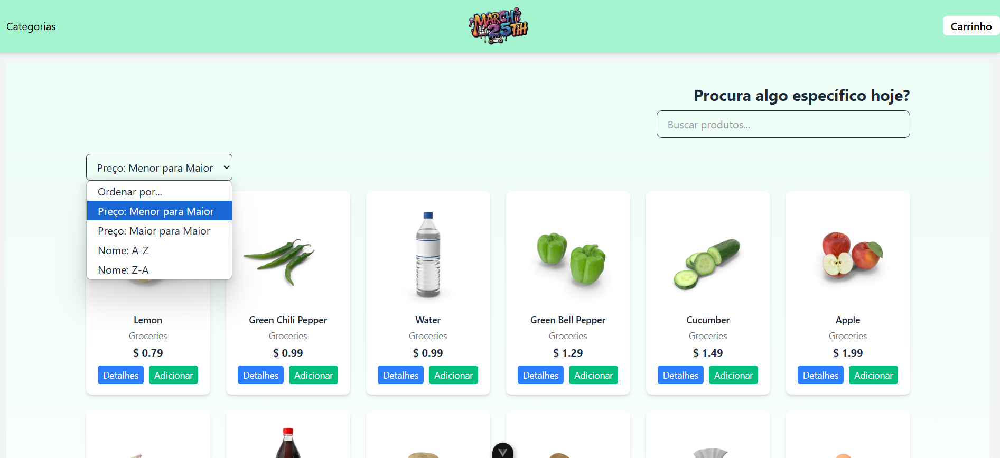
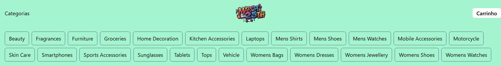
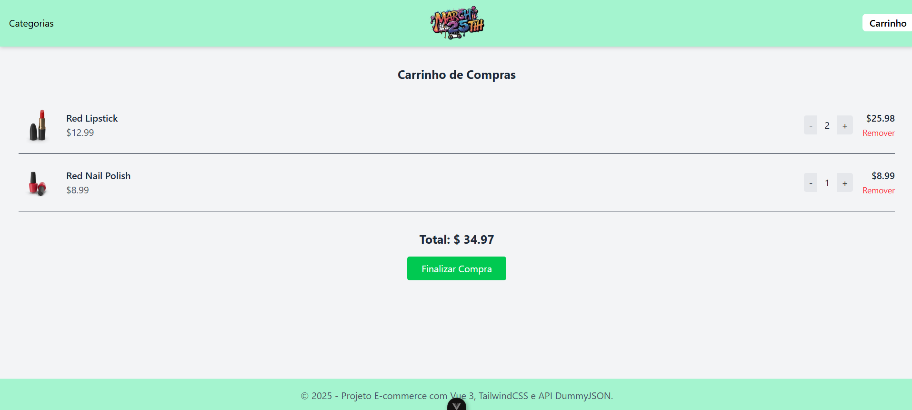
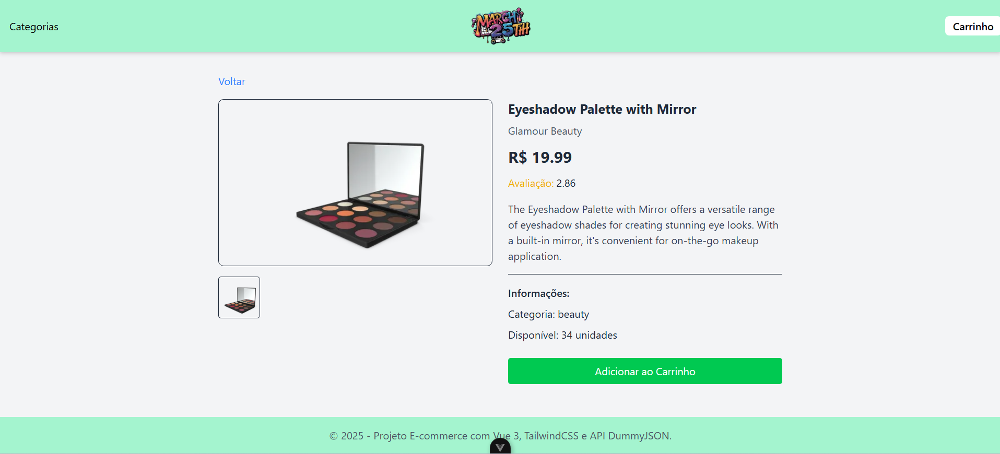
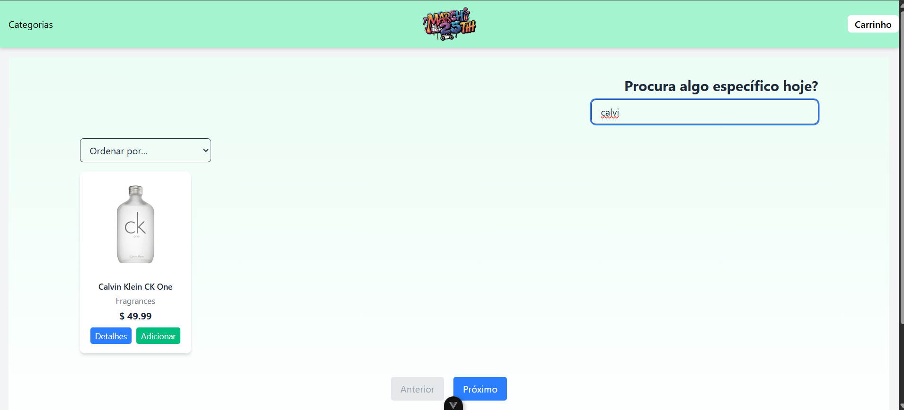
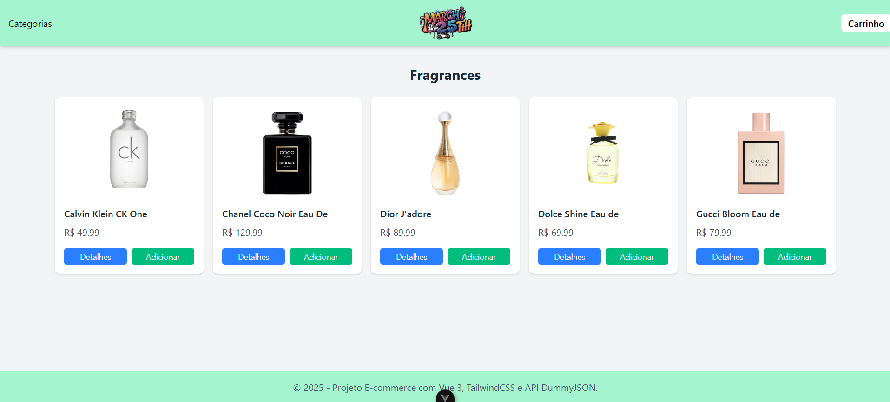
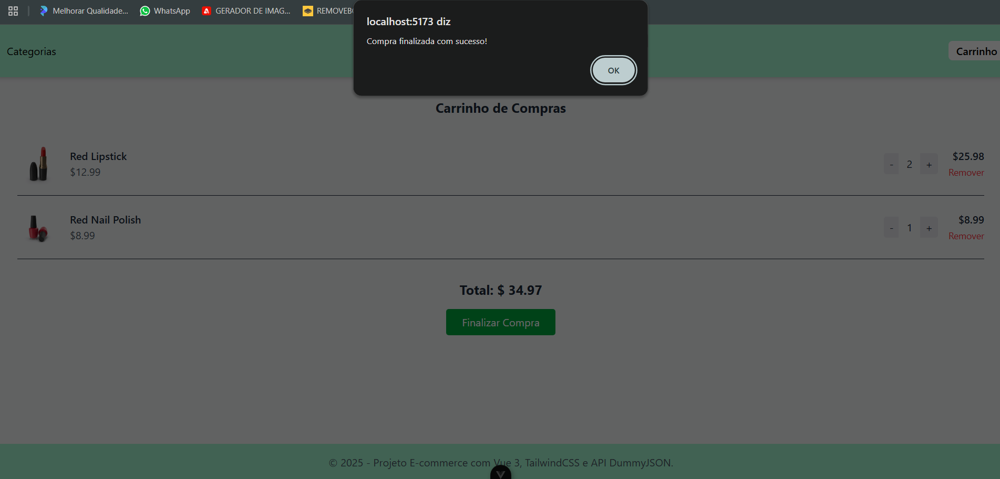

## Ecommerce March 25TH

## Descrição do projeto

Esse projeto front-end desenvolvida com Vue.js é uma demonstração 
de um e-commerce virtual linkado com uma API DummyJSON
[https://dummyjson.com/docs/products]

## Funcionalidades

- Listagem dos produtos por API
- Buscar produtos
- Ordenação por preço ou nome
- Detalhes dos produtos
- Carrinho
- Categorias
- Paginação

## Screenshots

### Ordenagem dos produtos

### Menu Categorias

### Carrinho

### Paginação

### Detalhes do produto

### Buscar Produto

### Categorias

### Pedido Finalizado

## Tecnologias Usadas

- Vue.js
- Axios
- Vite
- Tailwind

## Como rodar o projeto localmente

- git clone https://github.com/guiioliveira10/Ecommerce
- cd ecommerce
- npm install
- npm run dev

### Pré-requisitos

- Node.js
- npm

## link do youtube

https://youtu.be/ZC1ebHGvdBk

## Nome e RA

Guilherme de Paula Oliveira - RA: 1991857
Eduardo Santos - RA: 1989619